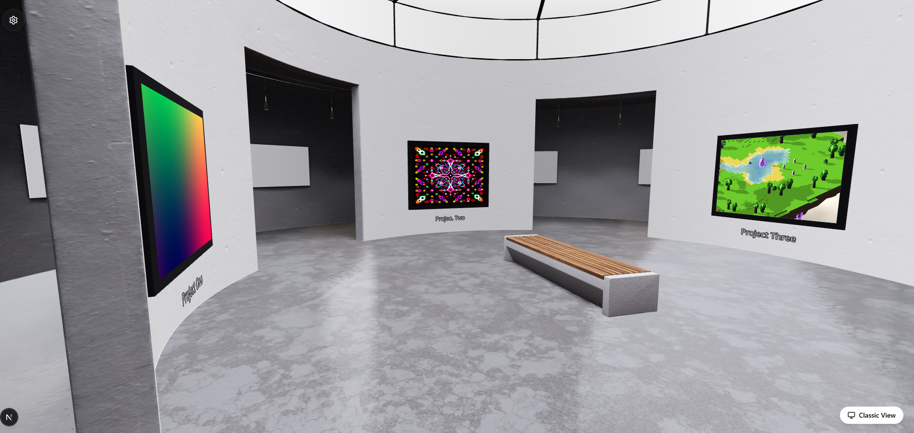
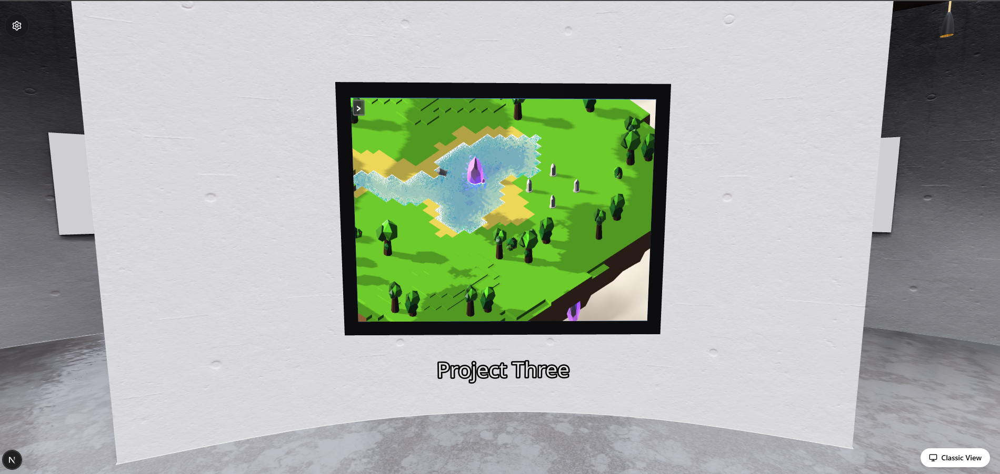
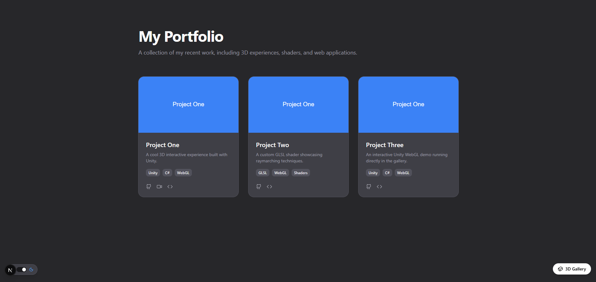

# 3D Portfolio Gallery

An interactive, first-person 3D gallery built with **Next.js 15**, **React Three Fiber**, and **MDX**. Visitors walk through a virtual art gallery where each painting represents one of your projects. Clicking or pressing **E** zooms into the canvas and navigates to the full project detail page.

> **Public template** — fork this repo, drop in your own projects, shaders, Unity builds and thumbnails, and you have a ready-to-deploy portfolio.

---

## Screenshots

<!-- SCREENSHOTS NEEDED — please take the following and place them in public/readme/:

  1. screenshots/gallery-overview.png
     The gallery room from a standing position — paintings visible on curved walls,
     spotlights, bench in centre. Taken at medium distance so all 3 painting frames show.

  2. screenshots/gallery-unity-painting.png
     Close-up of the Unity WebGL painting mid-game (game is running, fills the frame,
     no black bars). Stand directly in front of it.

  3. screenshots/gallery-shader-painting.png
     Close-up of an animated GLSL shader painting (fractal or generic) running live.

  4. screenshots/gallery-oblique.png
     Looking at the Unity painting from a side angle showing the perspective-correct
     CSS matrix3d warp tracking the canvas.

  5. screenshots/mode-select.png
     The welcome / mode-select overlay (dark backdrop with "Enter Experience" card).

  6. screenshots/project-detail-unity.png
     The project detail page for a Unity project — full-width 16:9 Unity embed,
     fullscreen button visible top-right, tags below the title.

  7. screenshots/project-detail-shader.png
     The project detail page for a GLSL shader project — canvas embed with the
     shader controls panel open below it.

  8. screenshots/portfolio-grid.png
     The /portfolio classic card-grid view (fallback for non-WebGL visitors).
-->

| Gallery room | Unity painting live | Project detail |
|:---:|:---:|:---:|
|  |  |  |

---

## Features

- **Two navigation modes** — WASD + mouse-look (pointer lock) or point-and-click with edge panning
- **MDX-driven projects** — each `.mdx` file in `content/projects/` becomes a gallery painting and a detail page automatically
- **Unity WebGL embeds** — live Unity builds run directly on the painting canvas with perspective-correct CSS homography tracking; also embed on the project detail page at 16:9 with native fullscreen
- **GLSL shader materials** — attach live animated fragment shaders to any painting with optional interactive uniform controls (sliders and colour pickers) on the detail page
- **Shadertoy embeds** — paste a Shadertoy ID to embed any public shader
- **Video painting texture** — looping `.mp4` / `.webm` as a Three.js VideoTexture on the canvas
- **GitHub card** — live star/fork counts via a server-side proxied GitHub API route
- **Static generation** — all project pages are pre-rendered at build time (`generateStaticParams`)
- **Edit mode** — press `` ` `` to open the Leva panel, enable Edit Mode and drag-to-place paintings in the room; copy their transform back to frontmatter
- **Classic view toggle** — visitors who disable WebGL fall back to a standard card grid at `/portfolio`

---

## Tech Stack

| Layer | Library |
|---|---|
| Framework | Next.js 15 (App Router) |
| 3D rendering | React Three Fiber v9, Three.js |
| 3D helpers | @react-three/drei (PointerLockControls, Environment, Text, …) |
| Animation | @react-spring/three (hover), Framer Motion (page transitions) |
| Content | MDX via `next-mdx-remote` + `gray-matter` |
| Styling | Tailwind CSS v4 |
| UI | Radix UI, shadcn/ui, Lucide icons |
| Dev tooling | TypeScript 5, ESLint, Leva (in-scene edit mode) |

---

## Getting Started

### Prerequisites

- Node.js 18 or later
- npm / yarn / pnpm / bun

### Installation

```bash
git clone https://github.com/your-username/portfolio-gallery.git
cd portfolio-gallery
npm install
```

### Development server

```bash
npm run dev
```

Open [http://localhost:3000](http://localhost:3000).

### Production build

```bash
npm run build
npm run start
```

---

## Adding a Project

Each project is a single `.mdx` file inside `content/projects/`.

### 1. Create the MDX file

```
content/projects/my-project.mdx
```

The filename becomes the URL slug: `/projects/my-project`.

### 2. Full frontmatter reference

```yaml
---
title: "My Project"           # Display name — painting label + detail page heading
slug: "my-project"            # Must match the filename (without .mdx)
date: "2026-01-01"            # ISO date — used for newest-first sort order
description: "Short blurb"   # Meta description and portfolio grid summary
tags: ["Unity", "C#", "WebGL"]

# ─── Painting texture — pick ONE ────────────────────────────────────────────
thumbnail: "/thumbnails/my-project/thumbnail.png"  # static image (recommended 4:3)
# videoUrl: "/videos/my-project.mp4"               # looping video texture on the canvas
# material: "myShader"                              # registered GLSL shader key (see below)

# ─── 3D placement in the gallery room ───────────────────────────────────────
# Leave out to use defaults; or enable Edit Mode and copy the values from Leva.
position: [0.0, 1.50, -4.63]   # [x, y, z] world units
rotation: [0.00, 0.00, 0.00]   # [rx, ry, rz] radians

# ─── Optional links ──────────────────────────────────────────────────────────
githubUrl: "https://github.com/you/my-project"

# ─── Detail page embed — pick ONE type ──────────────────────────────────────
shaderType: "none"            # "unity" | "glsl" | "shadertoy" | "none"

# If shaderType is "unity":
# shaderSrc: "/unity-builds/myBuild"

# If shaderType is "glsl":
# shaderSrc: "/shaders/myShader.glsl"   (path to raw GLSL fragment source)
# material: "myShader"                  (registry key — same as the painting key)
# shaderUniforms:                       (optional interactive controls)
#   - name: uSpeed
#     label: Speed
#     type: float
#     default: 1.0
#     min: 0.1
#     max: 3.0
#     step: 0.1
#   - name: uTint
#     label: Tint
#     type: color
#     default: "#ffffff"

# If shaderType is "shadertoy":
# shaderSrc: "XdXGDs"   (the Shadertoy shader ID from the URL)
---

# My Project

Write your full project description here using standard Markdown / MDX.
```

### 3. Add a thumbnail

Place the image at the path specified in `thumbnail`:

```
public/thumbnails/my-project/thumbnail.png
```

Recommended aspect ratio: **4:3** (the painting canvas is 2 × 1.5 world units).

---

## Adding a Unity WebGL Build

Unity builds play live on the painting canvas in the gallery *and* on the project detail page.

### Unity export settings

| Setting | Value |
|---|---|
| Platform | WebGL |
| Template | **Minimal** (not Default — Minimal removes black bars and background) |
| Resolution | **960 × 540** (16:9 — matches the iframe ratio used by the gallery) |
| Compression | **Gzip** or **Brotli** (both supported; the dev server adds the correct headers automatically) |
| Color Space | Linear |
| Decompression Fallback | Off (the Next.js headers handle this) |

> **Why Minimal template?** The Default template wraps the canvas in a grey container with a loading bar and footer that clash with the gallery style. Minimal gives a bare canvas that fills the embed perfectly.

### 1. Export from Unity

In Unity: **File → Build Settings → WebGL → Build**.  
Unity creates a folder like `MyBuild/` containing `index.html`, `Build/`, and `TemplateData/`.

### 2. Place the build

Copy the entire exported folder into `public/unity-builds/`:

```
public/
  unity-builds/
    myBuild/
      index.html
      Build/
        myBuild.loader.js
        myBuild.data.gz        ← or .data.br
        myBuild.wasm.gz
        myBuild.framework.js.gz
```

### 3. Set up the frontmatter

```yaml
shaderType: "unity"
shaderSrc: "/unity-builds/myBuild"   # path to the folder (no trailing slash)
```

The `thumbnail` field is still used as the painting texture in the gallery. The Unity iframe overlays it with perspective-correct tracking — the thumbnail shows as a fallback while Unity loads.

### How the gallery overlay works

The Unity iframe is mounted directly in `document.body` (bypassing React's DOM) so that `position: fixed` is truly viewport-relative. Each frame, Three.js projects all four corners of the painting mesh from world space → NDC → CSS pixels and applies a CSS `matrix3d` perspective homography to the iframe wrapper. A Three.js frustum check hides the overlay the moment the painting leaves the camera's view frustum so it never renders on the wrong side of the room.

### How the detail page embed works

The project detail page uses a 16:9 container that breaks out of the prose column width. A `<style>` tag is injected into the Unity iframe on load so the canvas fills the container via CSS (`width: 100% !important`) regardless of Unity's built-in inline sizing. The **Fullscreen** button calls `requestFullscreen()` on the container div — the canvas inherits 100% width/height and fills the screen without black bars.

### Compression headers

`next.config.ts` already includes headers for gzip and brotli Unity assets. No extra configuration is needed:

```
Cross-Origin-Opener-Policy: same-origin      ← required for SharedArrayBuffer (threads)
Cross-Origin-Embedder-Policy: require-corp
Content-Encoding: gzip / br                  ← served for .js.gz, .wasm.gz, .data.gz, etc.
```

---

## Adding a GLSL Shader

Attach a live animated fragment shader to a painting canvas and optionally expose interactive controls on the project detail page.

### 1. Create a shader material component

```tsx
// materials/myShader.tsx
'use client';
import { useRef } from 'react';
import { useFrame } from '@react-three/fiber';
import { animated } from '@react-spring/three';
import * as THREE from 'three';

const vertexShader = /* glsl */`
  varying vec2 vUv;
  void main() {
    vUv = uv;
    gl_Position = projectionMatrix * modelViewMatrix * vec4(position, 1.0);
  }
`;

const fragmentShader = /* glsl */`
  uniform float uTime;
  uniform vec2  uResolution;
  uniform float uSpeed;   // example custom uniform
  varying vec2  vUv;
  void main() {
    vec2 uv = vUv * 2.0 - 1.0;
    gl_FragColor = vec4(uv, sin(uTime * uSpeed) * 0.5 + 0.5, 1.0);
  }
`;

interface Props {
  emissiveIntensity?: any;
  uniformOverrides?: Record<string, any>;
}

export default function MyShaderMaterial({ uniformOverrides = {} }: Props) {
  // Keep uniforms in a ref — never recreated on re-render
  const uniforms = useRef({
    uTime:       { value: 0 },
    uResolution: { value: new THREE.Vector2(2, 1.5) },
    uSpeed:      { value: uniformOverrides.uSpeed ?? 1.0 },
  });

  useFrame((_state, delta) => {
    uniforms.current.uTime.value += delta;   // delta — not clock.elapsedTime
    if (uniformOverrides.uSpeed !== undefined)
      uniforms.current.uSpeed.value = uniformOverrides.uSpeed;
  });

  return (
    // @ts-ignore — animated.shaderMaterial is fine at runtime
    <animated.shaderMaterial
      uniforms={uniforms.current}
      vertexShader={vertexShader}
      fragmentShader={fragmentShader}
    />
  );
}
```

> **Important:** Always accumulate time using the `delta` argument (`uniforms.current.uTime.value += delta`) rather than `state.clock.getElapsedTime()`. This keeps the shader running correctly after page navigation when the clock has been running since app start.

### 2. Register the material

Open `materials/registry.ts` and add your component:

```ts
import MyShaderMaterial from '@/materials/myShader';

export const materialRegistry: Record<string, React.ComponentType<any>> = {
  genericShader: GenericShaderMaterial,
  fractalShader: FractalShaderMaterial,
  myShader:      MyShaderMaterial,      // ← add this line
};
```

### 3. Reference it in frontmatter

```yaml
material: "myShader"       # key must match the registry entry

# For the detail page embed with interactive controls:
shaderType: "glsl"
shaderUniforms:
  - name: uSpeed
    label: Speed
    type: float
    default: 1.0
    min: 0.1
    max: 5.0
    step: 0.1
```

The `shaderUniforms` array drives a controls panel that appears below the canvas on the detail page. Supported `type` values:

| Type | UI control | `default` format |
|---|---|---|
| `float` | Slider | `1.0` |
| `color` | Colour picker | `"#ff8800"` |

---

## Painting Positions (Edit Mode)

Press `` ` `` (backtick) in the gallery to open the Leva dev panel. Enable **Edit Mode** to show transform gizmos on every painting. Drag a painting to a new position, then click **Copy Transform** in the Leva panel to copy the exact `position` and `rotation` YAML values to your clipboard. Paste them into the project's frontmatter.

---

## Navigation Reference

### WASD mode

| Input | Action |
|---|---|
| W / A / S / D | Move |
| Mouse | Look around (pointer lock) |
| Click canvas | Acquire pointer lock |
| E or Enter | Zoom into / open the nearest painting |
| Escape | Release pointer lock |

### Click-to-Move mode

| Input | Action |
|---|---|
| Click floor | Walk to that position |
| Mouse near left / right edge | Pan camera horizontally |
| Click painting (within 2 m) | Open project |

### Global

| Input | Action |
|---|---|
| `` ` `` (backtick) | Toggle Leva dev / edit panel |

---

## Environment Variables

| Variable | Required | Description |
|---|---|---|
| `GITHUB_TOKEN` | Optional | Personal access token. Raises GitHub API rate limit from 60 → 5 000 req/hr for the GitHub card on detail pages. |

```env
# .env.local
GITHUB_TOKEN=ghp_xxxxxxxxxxxxxxxxxxxx
```

---

## Personalisation

### Gallery name

In `components/gallery/GalleryScene.tsx`, find the welcome overlay and update the subtitle:

```tsx
<p className="... mb-12">
  To the gallery of User   {/* ← replace "User" with your name */}
</p>
```

---

## Project Structure

```
app/
  gallery/           3D gallery page
  portfolio/         Simplified card grid fallback
  projects/[slug]/   Project detail page (statically generated)
  api/github/        Server-side GitHub API proxy

components/
  gallery/
    GalleryScene        Canvas shell + UI overlays
    GalleryRoom         Room geometry and painting placement
    PlayerController    WASD / click movement, camera control, collision
    InteractionManager  Zoom trigger, painting proximity detection
    Painting            Painting mesh + material selection + Unity overlay
    EditableTransform   Dev-only drag-to-place gizmo
  projects/
    ProjectDetail       Detail page layout
    UnityEmbed          16:9 iframe embed with native fullscreen
    ShaderEmbed         GLSL canvas or Shadertoy iframe + uniform controls
    VideoEmbed          YouTube / local video embed
    GithubCard          Live repo stats card
  shared/
    FallbackDetector    Detects WebGL support, redirects to /portfolio
    ViewToggle          3D ↔ Classic switch

content/projects/    *.mdx files — add your projects here
materials/
  registry.ts        String key → shader component map
public/
  unity-builds/      Unity WebGL exports (one subfolder per build)
  shaders/           Built-in shader material components
  thumbnails/        Static project thumbnail images
  videos/            Local video assets
```

---

## Deployment

### Vercel (recommended)

1. Push the repo to GitHub
2. Import at [vercel.com/new](https://vercel.com/new)
3. Set the `GITHUB_TOKEN` environment variable in the Vercel project settings
4. Deploy — Vercel detects Next.js automatically

### Other Node.js hosts

```bash
npm run build
npm run start      # serves from .next/
```

Any Node.js 18+ platform works (Render, Railway, Fly.io, self-hosted VPS, etc.).

---

## License

MIT — free to use, fork and modify. Attribution appreciated but not required.
